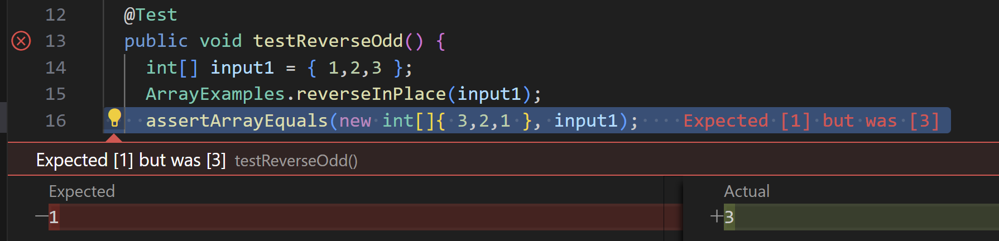
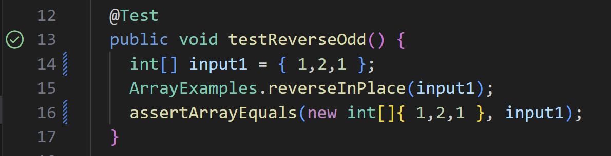
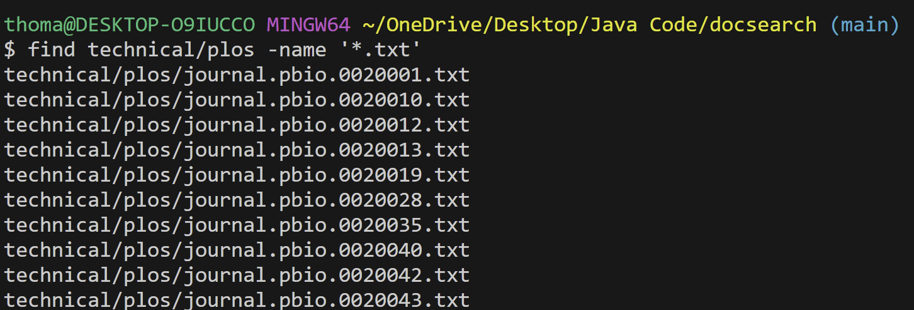
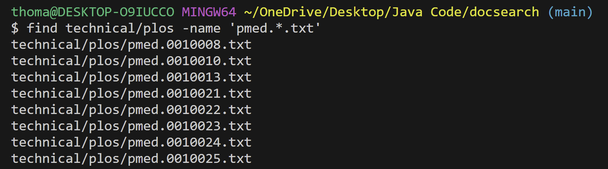
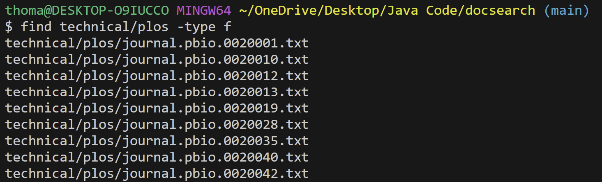
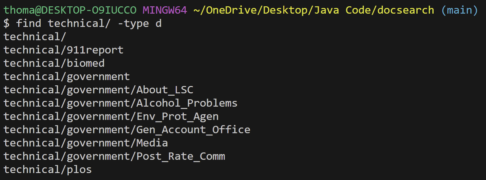
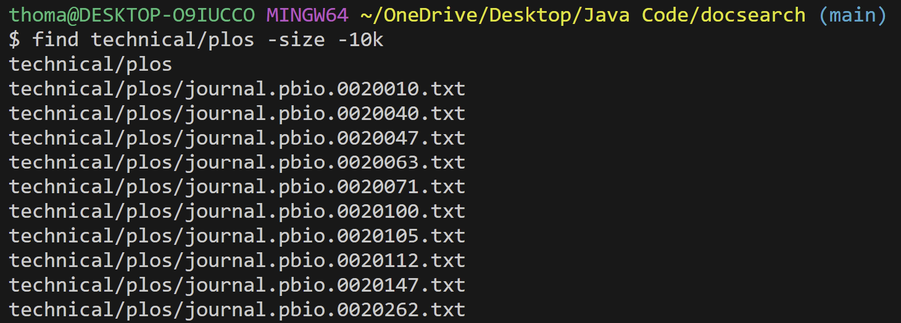

## Part 1
* Failure-inducing input
```
@Test
 public void TestReverseOdd() {
   int[] input = {1, 2, 3}; 
   ArrayExamples.reverseInPlace(input);
   assertArrayEquals(new int[]{ 3, 2, 1}, input);
```
* Successful input
```
@Test
 public void TestReverseOdd() {
   int[] input = {1, 2, 1}; 
   ArrayExamples.reverseInPlace(input);
   assertArrayEquals(new int[]{ 1, 2, 1}, input);
```
* Symptoms
1.  <br>
2.  <br>
* Bugs
1. Before
```
static void reverseInPlace(int[] arr) {
    for(int i = 0; i < arr.length; i += 1) {
      arr[i] = arr[arr.length - i - 1];
    }
  }
```  
2. After
```
static void reverseInPlace(int[] arr) {
    for(int i = 0; i < arr.length/2; i += 1) {
      int temp = arr[i];
      arr[i] = arr[arr.length - i - 1];
      arr[arr.length - i - 1] = temp;
    }
  }
```
The code is functional until halfway through the array, where it then starts to reverse using the changed values. So, a temporary value is useful in saving the original value before it is changed in order to change the values in the latter half of the array.
## Part 2
*`find` command
1. `-name` <br>
a. `$ find technical/plos -name '*.txt'` <br>
 <br>
This is useful in searching all files with names containing `.txt` within the given directory. <br>
b. `$ find technical/plos -name 'pmed.*.txt'` <br>
 <br>
This is useful, like the previous one, but more specific to files containing `pmed` as well. <br>
2. `-type` <br>
a. `$ find technical/plos -type f` <br>
 <br>
This is useful for finding all files within the given directory. <br>
b. `$ find technical/ -type d` <br>
 <br>
This is useful for finding all directories within the given directory. <br>
3. `-size` <br>
a. `$ find technical/plos -size -10k` <br>
 <br>
This is useful in finding files in the given directory that are smaller than 10 KB. <br>
b. `$ find technical/plos -size +10k` <br>
 <br>
This is useful in finding files in the given directory that are larger than 10 KB. <br>
4. `-mtime` <br>
a. `$ find technical/plos -mtime -7` <br>
This is useful for finding files in the given directory that have been modified within the past 7 days. <br>
b. `$ find technical/plos -mtime +4` <br>
This is useful for finding files in the given directory that have not been modified within the past 4 days. <br>


Citation: https://tecadmin.net/linux-find-command-with-examples/
